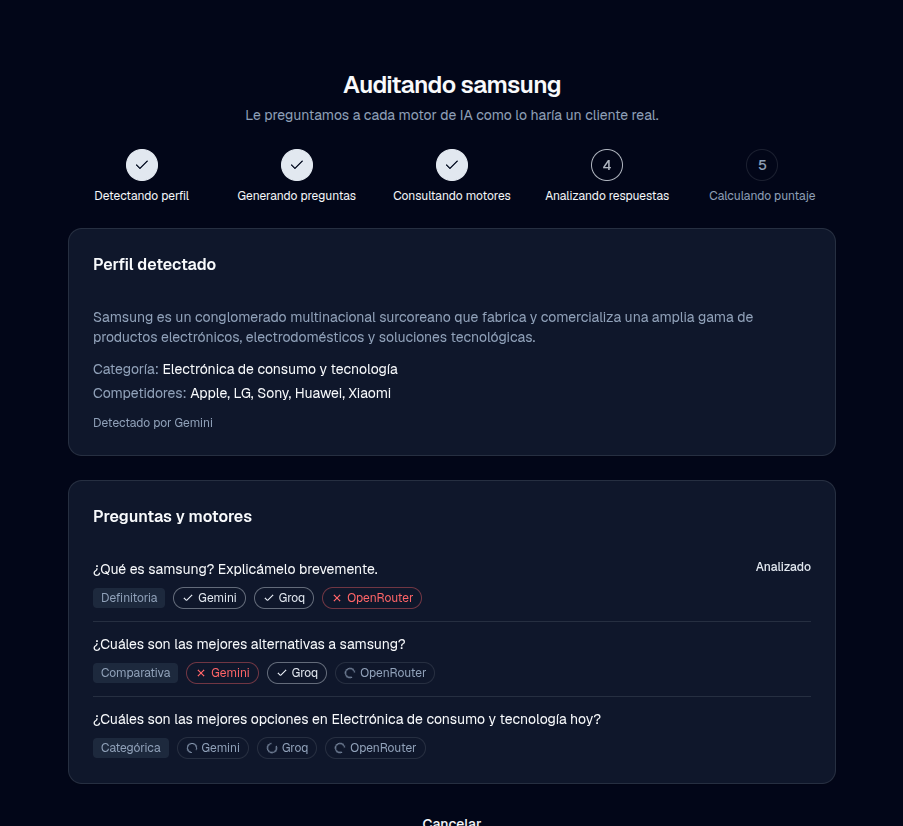
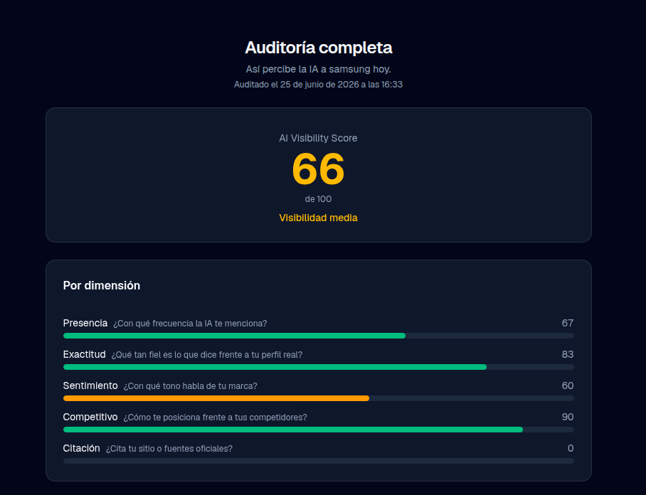
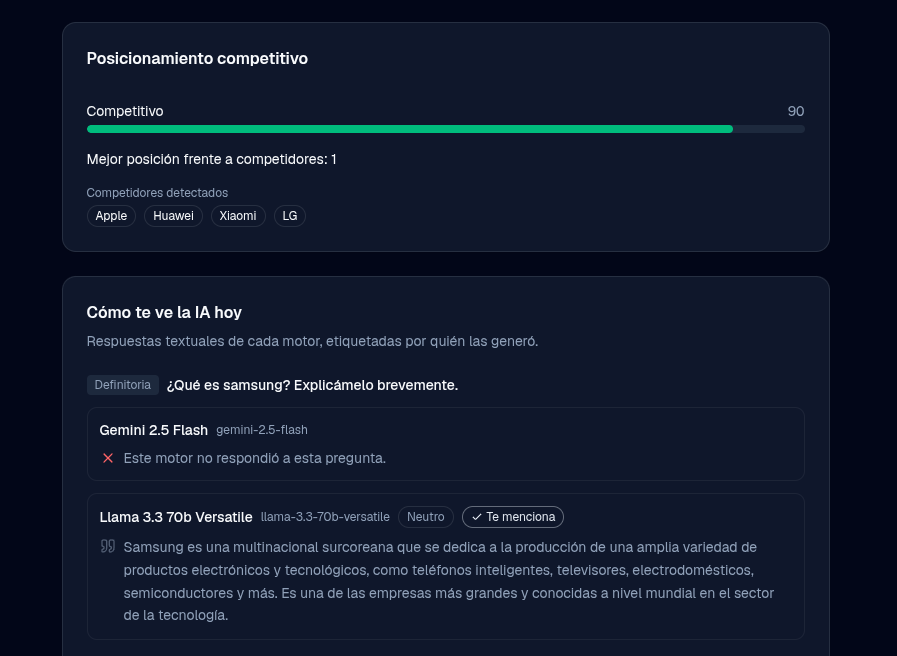
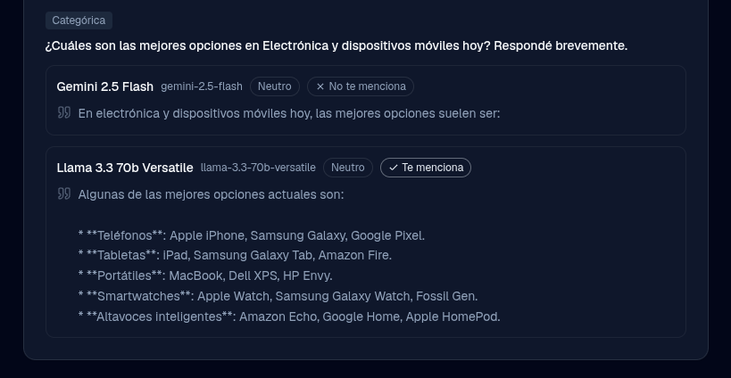
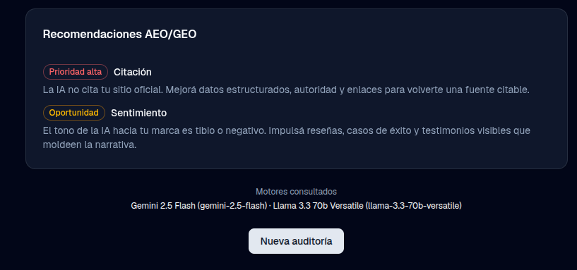

# AEO/GEO Auditor

Aplicación web que **audita cómo los asistentes de IA perciben una marca**, le asigna un
**AI Visibility Score (0–100)** y entrega **recomendaciones accionables** de AEO/GEO
(Answer / Generative Engine Optimization, la disciplina sucesora del SEO).

<p>
  
  
  
  
  
</p>

> **Contexto:** demo de portafolio. Audiencia = especialistas en AEO/GEO, por lo que el proyecto
> busca ser **creíble en su metodología** e **impecable en lo visual**.

<table>
  <tr>
    <td width="50%" align="center" valign="top">
      
      <br><sub><b>Landing</b> · ingreso de marca y ejemplos sugeridos</sub>
    </td>
    <td width="50%" align="center" valign="top">
      
      <br><sub><b>Progreso en vivo</b> · perfil, preguntas y consulta multi-motor</sub>
    </td>
  </tr>
  <tr>
    <td width="50%" align="center" valign="top">
      
      <br><sub><b>Auditoría completa</b> · AI Visibility Score y dimensiones</sub>
    </td>
    <td width="50%" align="center" valign="top">
      
      <br><sub><b>Posicionamiento competitivo</b> · respuestas por motor</sub>
    </td>
  </tr>
  <tr>
    <td width="50%" align="center" valign="top">
      
      <br><sub><b>Respuestas categóricas</b> · etiquetadas por cada motor</sub>
    </td>
    <td width="50%" align="center" valign="top">
      
      <br><sub><b>Recomendaciones AEO/GEO</b> · accionables y motores consultados</sub>
    </td>
  </tr>
</table>

---

## Tabla de contenidos

- [Qué resuelve](#qué-resuelve)
- [Cómo funciona](#cómo-funciona)
- [Dimensiones del score](#dimensiones-del-score)
- [Motores de IA](#motores-de-ia)
- [Arquitectura](#arquitectura)
- [Stack](#stack)
- [Puesta en marcha](#puesta-en-marcha)
- [Variables de entorno](#variables-de-entorno)
- [Scripts](#scripts)
- [Testing y calidad](#testing-y-calidad)
- [Estructura del proyecto](#estructura-del-proyecto)
- [Documentación](#documentación)

---

## Qué resuelve

El SEO clásico optimiza para los buscadores. Pero cada vez más usuarios preguntan directamente a
asistentes de IA ("¿qué plataforma de streaming me conviene?"), y esos modelos responden con su
propia visión de cada marca: si te mencionan, con qué exactitud, con qué sentimiento y frente a qué
competidores. **AEO/GEO Auditor mide esa visibilidad** y la convierte en un puntaje accionable.

Cada cita o respuesta se etiqueta con **qué motor la generó** (honestidad del modelo): nunca se
afirma "ChatGPT dice X" si la respuesta provino de otro modelo.

## Cómo funciona

1. **Input:** nombre de marca o URL.
2. **Auto-detección (IA):** categoría, descripción canónica y competidores principales.
3. **Generación de prompts** con las intenciones de un cliente real (definitoria, evaluativa,
   comparativa, categórica sin marca, recomendación).
4. **Ejecución multi-motor:** cada prompt se corre en paralelo en los motores de IA disponibles.
5. **Análisis (LLM-as-judge):** presencia, exactitud, sentimiento, posición competitiva y
   citación de fuente, con salida estructurada validada por Zod.
6. **Scoring + reporte:** puntaje 0–100 con desgloses por dimensión y motor, citas textuales,
   comparación entre motores y recomendaciones.

El progreso se transmite en vivo al cliente vía **SSE**, fase por fase.

## Dimensiones del score

| Dimensión             | Qué mide                                                            |
| --------------------- | ------------------------------------------------------------------ |
| **Presencia**         | ¿Aparece la marca cuando debería?                                  |
| **Exactitud**         | ¿Lo que el modelo afirma sobre la marca es correcto?               |
| **Sentimiento**       | Tono con el que el modelo habla de la marca.                       |
| **Posición competitiva** | Cómo queda la marca frente a sus competidores en las respuestas.|
| **Citación de fuente**| ¿El modelo cita la fuente / sitio oficial de la marca?            |

El score final (0–100) es determinístico: se calcula con funciones puras a partir del juicio
estructurado de cada prompt, sin llamadas extra al LLM.

## Motores de IA

La auditoría descubre en runtime qué motores tienen credencial y **degrada con elegancia**: si
falta una key, ese motor simplemente no participa y el resto sigue funcionando.

| Motor          | Modelo por defecto                              | Variable de key       |
| -------------- | ----------------------------------------------- | --------------------- |
| **Gemini**     | `gemini-2.5-flash` (Google AI Studio, free tier)| `GEMINI_API_KEY`      |
| **Groq**       | `llama-3.3-70b-versatile` (free, sin tarjeta)   | `GROQ_API_KEY`        |
| **OpenRouter** | `meta-llama/llama-3.3-70b-instruct:free`        | `OPENROUTER_API_KEY`  |

Cada modelo se puede sobrescribir con `GEMINI_MODEL`, `GROQ_MODEL` u `OPENROUTER_MODEL`.

## Arquitectura

Capas estrictas, dependencias que entran solo por barrels públicos, y un núcleo de funciones puras
(prompts, scoring, parsers) sin red ni efectos:

```
UI (React/RSC)
  └─ hook + parser SSE
       └─ API route  (/api/audit)
            └─ orquestador de auditoría  (server/audit)
                 ├─ profile   → auto-detección de marca (1 llamada LLM)
                 ├─ prompts   → generación determinística de intenciones
                 ├─ engines   → ejecución multi-motor en paralelo (server/engines)
                 ├─ judge     → LLM-as-judge con salida validada (Zod)
                 └─ scoring   → puntaje 0–100 (puro, determinístico)
```

Principios clave (ver [`AGENTS.md`](./AGENTS.md) para el detalle):

- **Depender de interfaces, no implementaciones:** los motores cumplen el contrato `Engine`.
- **Secretos solo en servidor:** las keys se leen con `server-only`, nunca cruzan al bundle.
- **Errores normalizados:** al cliente solo viaja el `kind` del error; el detalle queda en logs.
- **Cancelación propagada:** `AbortController` llega hasta las llamadas externas.

## Stack

- **Next.js 16** (App Router, RSC) + **TypeScript** estricto
  (`noUncheckedIndexedAccess`, `noImplicitOverride`)
- **Tailwind CSS v4** + **shadcn/ui** (estilo `new-york`, base `slate`)
- **next-intl** — español (default, `/`) e inglés (`/en`)
- **next-themes** — tema claro / oscuro / sistema
- **Zod** — validación de input y de la salida estructurada del juez
- IA del lado del servidor vía `fetch` nativo (sin SDKs)
- Progreso en vivo vía **SSE**
- Deploy en **Vercel** (free tier)

## Puesta en marcha

**Requisitos:** Node.js 20+ y pnpm 10+ (`corepack enable pnpm`).

```bash
pnpm install
cp .env.example .env.local   # completá las API keys
pnpm dev                     # http://localhost:3000
```

- `/` → español (idioma por defecto)
- `/en` → inglés

## Variables de entorno

Ver [`.env.example`](./.env.example). Las claves se leen **solo del servidor** y nunca se exponen
al cliente. Basta con configurar **al menos un motor** para correr la app:

| Variable             | Requerida | Descripción                                  |
| -------------------- | --------- | -------------------------------------------- |
| `GEMINI_API_KEY`     | opcional¹ | Key de Google AI Studio.                     |
| `GROQ_API_KEY`       | opcional¹ | Key de Groq.                                 |
| `OPENROUTER_API_KEY` | opcional¹ | Key de OpenRouter.                           |
| `GEMINI_MODEL`       | no        | Sobrescribe el modelo de Gemini.             |
| `GROQ_MODEL`         | no        | Sobrescribe el modelo de Groq.               |
| `OPENROUTER_MODEL`   | no        | Sobrescribe el modelo de OpenRouter.         |

¹ Individualmente opcionales, pero se necesita **al menos una** para que haya un motor disponible.

## Scripts

| Script              | Descripción                          |
| ------------------- | ------------------------------------ |
| `pnpm dev`          | Servidor de desarrollo               |
| `pnpm build`        | Build de producción                  |
| `pnpm start`        | Servir el build                      |
| `pnpm lint`         | ESLint                               |
| `pnpm typecheck`    | Chequeo de tipos (`tsc --noEmit`)    |
| `pnpm test`         | Tests unitarios / de componentes     |
| `pnpm test:watch`   | Tests en modo watch                  |
| `pnpm test:cov`     | Tests con reporte de cobertura       |
| `pnpm e2e`          | Tests end-to-end (Playwright)        |
| `pnpm e2e:ui`       | Playwright en modo UI                |
| `pnpm format`       | Formatear con Prettier               |
| `pnpm format:check` | Verificar formato sin escribir       |

## Testing y calidad

- **Vitest** para unidad y componentes; **Playwright** para e2e. Los tests viven junto a la capa
  que cubren.
- Tests de **comportamiento**, no de implementación. Los componentes se ejercitan con Testing
  Library sobre las traducciones reales (`renderWithIntl`).
- Gate de cobertura definido en [`vitest.config.ts`](./vitest.config.ts): no se baja por debajo.
- CI en GitHub Actions corre lint, typecheck, tests con cobertura y la suite e2e.

`pnpm lint`, `pnpm typecheck` y `pnpm test` deben pasar antes de cada commit.

## Estructura del proyecto

```
src/
├─ app/
│  ├─ [locale]/          # rutas localizadas (página, layout)
│  └─ api/audit/         # route handler con streaming SSE
├─ server/
│  ├─ audit/             # orquestador, profile, prompts, judge, scoring (núcleo)
│  └─ engines/           # adaptadores de motores tras la interfaz Engine
├─ components/
│  ├─ dashboard/         # subcomponentes del reporte de resultados
│  └─ ui/                # primitivas shadcn/ui
├─ hooks/                # hooks de cliente (estado de auditoría)
├─ lib/                  # utilidades puras (parser SSE, formato de reporte)
├─ i18n/                 # configuración de next-intl
└─ types/                # tipos de dominio compartidos
messages/                # traducciones es / en
tests/ · e2e/            # Vitest · Playwright
```

## Documentación

- [`AGENTS.md`](./AGENTS.md) — estándares de código y convenciones del repo.
- [`docs/plan_de_trabajo.md`](./docs/plan_de_trabajo.md) — plan por fases (fuente de verdad).
- [`docs/IMPLEMENTATION_PLAN.md`](./docs/IMPLEMENTATION_PLAN.md) — espejo versionado del estado.
- [`docs/TOOLING.md`](./docs/TOOLING.md) — inventario de skills y MCP del proyecto.
